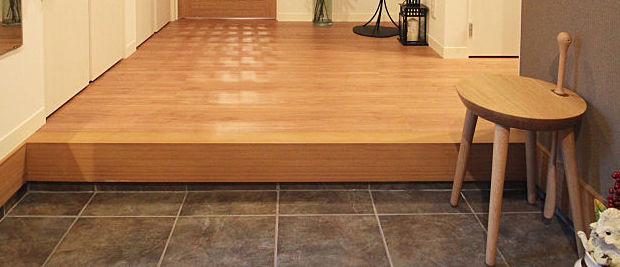
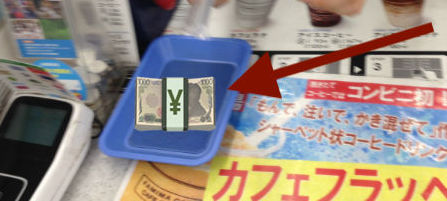
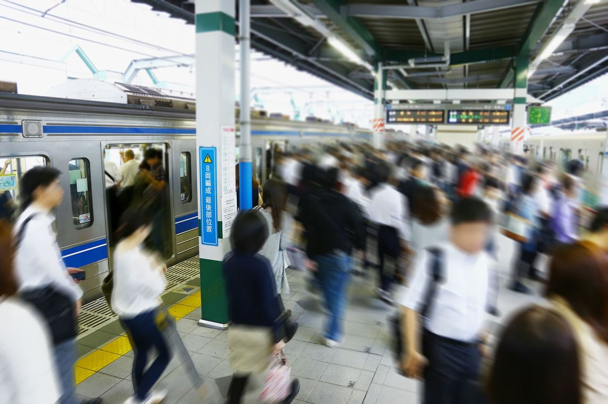
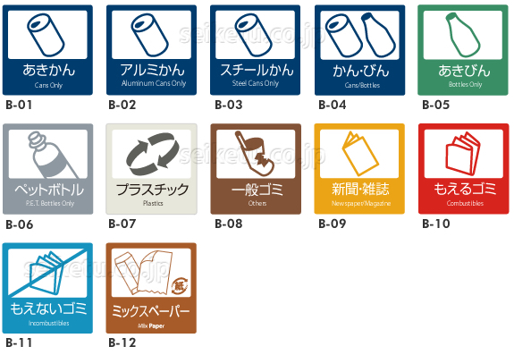

Title: Assorted Etiquette Notes
Date: 2018-1-07 22:00
Category: Culture
Cover: images/shimokitazawa.jpg

If you forget or get something wrong, you'll be fine. This list tops out at _faux pas_. Most aren't at that level.

- _**Shoes off, slippers on**_

> Won't happen much when out shopping, but when entering a home or anywhere you see one of these raised areas (_genkan_):

> Take your shoes off. There might be lockers for your shoes if you're entering a restaurant, or if it's a home, there might be a rack, or you might just turn your shoes around and rest them under the ledge. 
And I dunno where the slippers will be, but wear them.

> General rule: wherever there is one of these divides, shoes stay below. Wear slippers above.

> Sometimes there will be _other_ slippers in the bathroom; change your slippers when entering/leaving the bathroom if so.

- _**In general, don't eat outside**_

> Probably not a big deal to most people, but you probably won't see too much of this going on outside of festivals, etc.

> I think beverages are fine, though.

- _**Put money in the tray when checking out**_

> People don't generally pass money directly from hand to hand when checking out.

> Put your money in the tray if there is one (there usually is), and await your change & receipt in that same tray.

> If no tray is present, place your cash on the counter.

- _**Wait for passengers to exit train before entering**_

> Probably common sense if you've lived in an area with mass transit before.

> If it's busy enough for people to be queued while waiting for the train, just queue with them, or if you're on your own, wait by the side of the door for everyone to come out prior to entering.

- _**Stand to one side of the escalator**_

> I've always heard that the specific side to stand to is different in Tokyo vs. Osaka, but never bothered to confirm.

> In any event, if you want to stand still, keep to one side such that you aren't blocking walkers on the other side.

- _**Don't put soy sauce on white rice**_

> It's considered weird (hey, I don't write the rules).

> If there's something else on top of the rice (donburi or something), though, it's fine.

- _**Separate your trash**_

> In public places this will probably be pretty easy since the bins will be labeled (note, though, that there are _barely any trashcans anywhere_ in public, compared to the US).

> If we stay in an air b&b we'll need to figure out _how_ to sort the trash (it varies by location) and then do so.

> Generally it'll be some variation of cans, pet (plastic) bottles, non-burnable & burnable garbage being grouped together.

- _**Don't be noisy on the train**_

> It's generally pretty quiet in there.

- _**If you feel awkward checking out in silence**_

> Say "onegaishimasu" (oh-neh-guy-shee-mass) or just say "hello" if you want, I dunno.

- _**You don't have to respond to "irasshaimase"**_

> Clerks will say this (sometimes quite exuberantly) to welcome you into their shop. You don't have to respond.