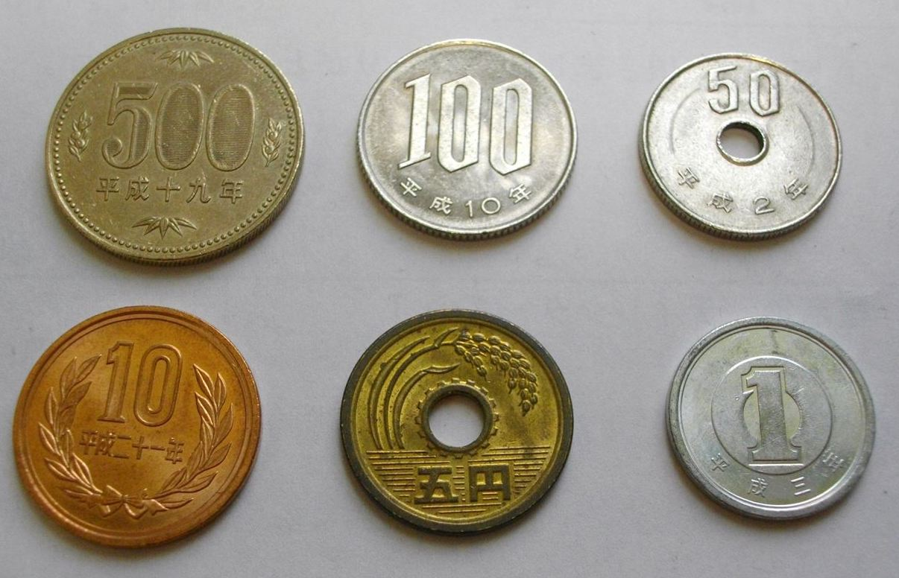
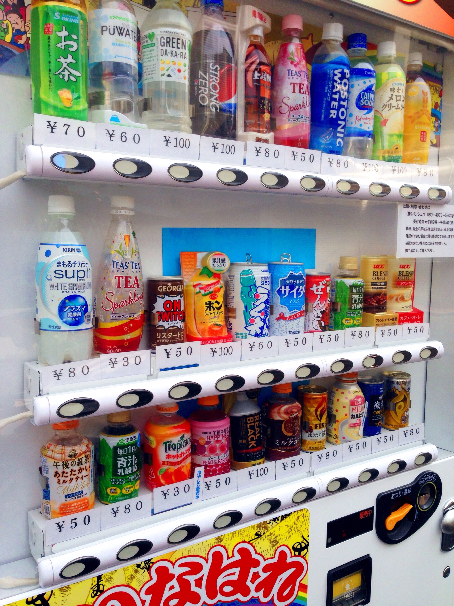
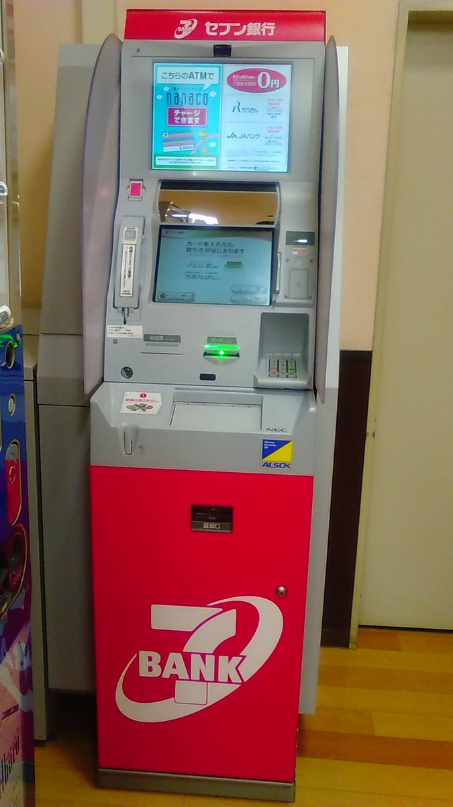
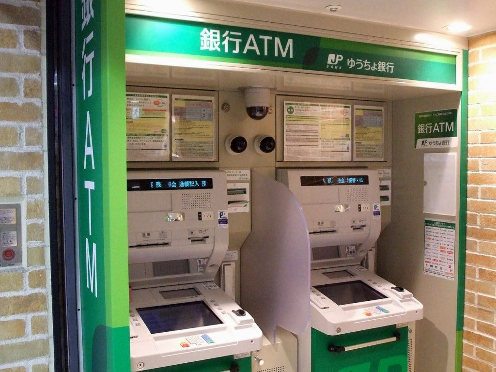
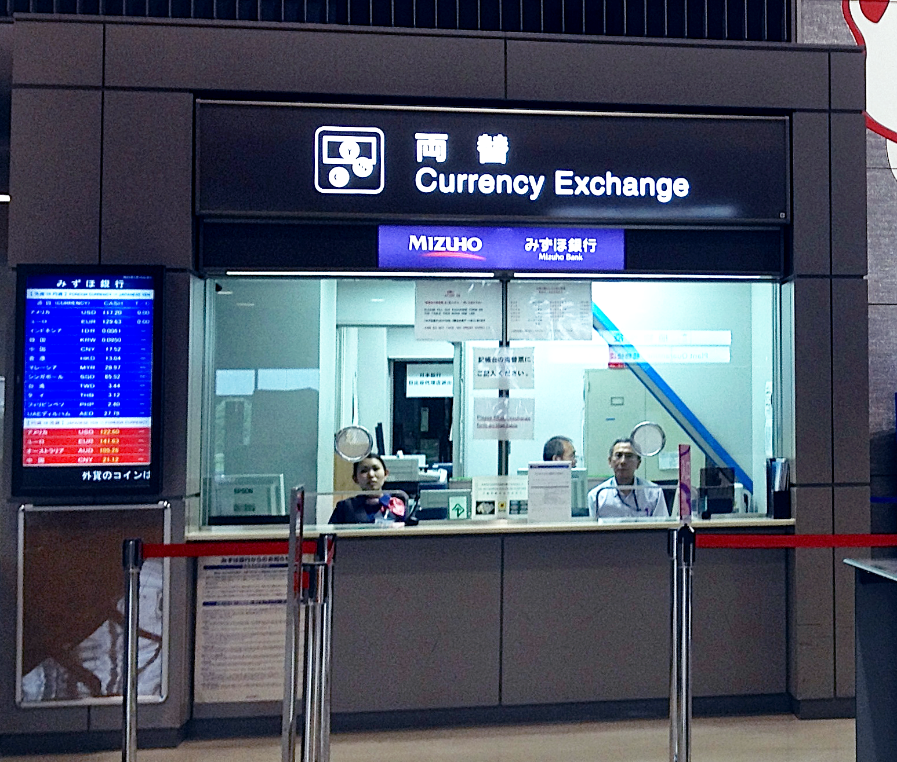

Title: Money
Date: 2018-1-08 22:00
Category: Logistics
Cover: images/yen.jpg

### Let's Get You Some Yen

As you may be aware, Japan is a primarily cash-based society.

While this may seem like a step backwards to people used to using credit/debit cards with chips, Apple Pay**, etc., I actually quite like it!

Japanese bills start at the equivalent of a $10 bill, not $1 or $5.

Those denominations are coins, _as they should be_ in this day and age.

Cash is more manageable since you won't have a wallet stuffed full of ones.

Just be sure to manage your coinage. To prevent 1/5/10-coins from accumulating, use them whenever you can.

Even if you don't have exact change, say, when making a 1,202 yen purchase, go ahead and pay 2,002 yen if you have two one-yen coins.

Or maybe just buy lots of stuff from vending machines.

_Side note:_ sales tax used to be included in all the prices that you'd see while out & about, but in 2014 the rate was raised to 8% and it ceased to be included. Now it's like what you're used to here. Phooey!

_Another side note_: you don't _have_ to use cash all the time in Japan-- [prepaid IC cards](http://youinjapan.net/moving/suica_pasmo_icoca.php) double as train passes and most people in metropolitan areas have them.

### _I digress._

Action plan for money:

- **Call your bank!**

A few days prior to departure (it's too early now), call & let them know that you'll be in Japan.

Don't want to get flagged for fraud just when you need that withdrawal most.

- **Withdraw money from ATMs in Japan**

This is what I've always done, and consensus seems to hold that this is how you get the best exchange rates.

Seven Bank ATMs (found in every 7-11) and Post Office Bank ATMs (found in every... post office) can withdraw from foreign accounts.

(I'd always used CitiBank ATMs personally, but [they are no more](http://www.findmyciti.com/jp/). _I think_ I've used a Seven Bank ATM for this purpose before, though.

[Seven Bank International ATM Service Page](https://www.sevenbank.co.jp/intlcard/card2.html)

[Post Office International ATM Service Page](http://www.jp-bank.japanpost.jp/en/ias/en_ias_index.html)

We'll be arriving to Narita terminal 2. [Both banks have ATMs there](https://www.narita-airport.jp/en/service/svc_12), so you'll be able to immediately make withdrawals.

Notes on ATM usage:

- You can use them (Seven Bank and Post Office Bank ATMs, at least) in English.

- There was apparently an international ATM scam making the rounds in late 2016, which has resulted in a 50,000-yen daily withdrawal limit (~$500). I figure that ~$1,000/day between the two banks will be plenty. If any of you are bigger ballers than I realize, I dunno, maybe bring your black card or just have your financial advisor look into this.

- Japanese ATMs have _hours_. Sometimes they simply cannot be used, other times they have increased fees (weekends, late-ish night). It isn't really worth worrying about, but is notable in being somewhat _bizarre_.

Personally, I won't be exchanging any money prior to arriving to Narita.

Exchanging within the US is apparently pretty ugly, rate-wise (I've never even done it), and there's no particular reason to use a currency exchange service in Chicago (or Narita) since you'll have access to these ATMs in Narita anyway.

If worst comes to worst and you can't use either ATM for some reason (which I don't anticipate), you could visit a currency exchange in Narita.

So maybe bring some backup dollars for that contingency.

[Additional reading on the subject of ATMs](https://www.japan-guide.com/e/e2208.html)

**Japan has Apple Pay too.