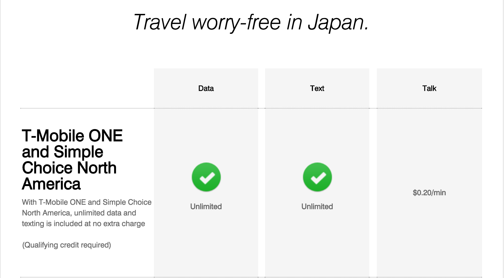
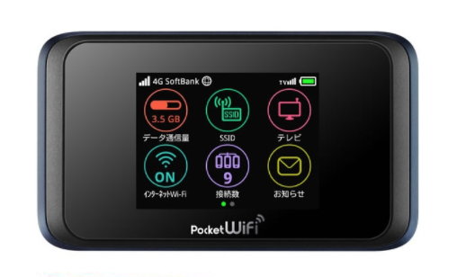
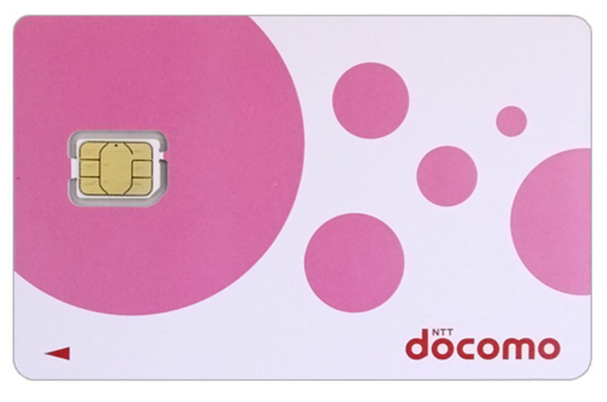

Title: Phone Service
Date: 2018-1-07 17:00
Category: Logistics
Cover: images/phewnze.jpg

You're probably going to want to be able to use your smartphone while we're in Japan.

In considering your options, an important first step is to figure out is whether or not your current carrier provides free international roaming.

It turns out, for example, that the plan I use (T-mobile Simple Choice North America) allows for free data roaming (but not calls) in Japan. I had no idea.

_However_, that data comes _at 2G speeds_, and I'm going to be using my phone to get train directions, etc. So 2G isn't going to cut it.

As such, 

### I went ahead and arranged to rent some things.

- **Pocket Wifi** (LTE speed, unlimited data, up to 10 connected devices, 7 days, will pick up in airport upon arrival). 

[Check product details here](http://japan-wireless.com/products.html) (it's the "Premium Wi-Fi" device.)

I figure that this will at least be a good backup plan for everyone, or perhaps your main source of connectivity depending on how you want to handle things.

It came to $60 for the week. Since we'll be sharing it,

**💸 Everyone please give JQ $12. 💸**

In addition to the pocket wifi, I arranged (also through [japan-wireless.com](http://japan-wireless.com)) to rent:

- a **prepaid SIM card** (Docomo network**, 500mb/day at LTE speed, unlimited slowness thereafter, 7 days). 

I figure that it'll be more convenient than using the pocket wifi while out & about, and it isn't particularly expensive ($30).

If you are interested in renting one yourself, 🔓_you'll need to figure out if your phone is unlocked_🔓.

The best way to do this is to call your carrier and ask them-- be sure to have your IMEI number ready to tell them. You can find the IMEI from `Settings` => `General` => `About` on iOS. I'm not sure about Android.

If your phone is not yet fully paid off and/or you're still under contract with your carrier, conventional wisdom seems to hold that it's probably locked.

_**If you do want to rent a SIM card**_, please talk to JQ so that we can rent it through the same company and have it delivered in the same shipment to the airport. Or feel free to make your own arrangements if desired; just figure that this will be a good way to simplify some of the logistics.

_If your phone is locked but you won't be satisfied with the pocket wifi_, you can rent a phone. I haven't researched this option yet, though.

**Docomo is one of the three major carriers in Japan. They are: Docomo, AU & Softbank.